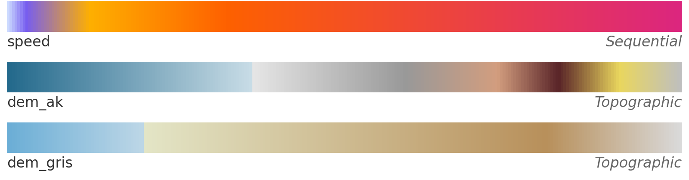

# cmglaciology

Colormaps for glaciology, packaged for Matplotlib.



| Name       | Type        | Intended use                         |
| ---------- | ----------- | ------------------------------------ |
| `speed`    | Sequential  | Ice surface speed                    |
| `dem_ak`   | Topographic | Surface/bed elevation, Alaska        |
| `dem_gris` | Topographic | Surface/bed elevation, Greenland     |

## Install

```sh
python -m pip install git+https://github.com/pism/cmglaciology.git
```

or, from a clone:

```sh
python -m pip install -e .
```

## Usage example

```python
import cmglaciology.cm as cmg
import matplotlib.pyplot as plt
import numpy as np

x = np.linspace(0, 1, 100)[np.newaxis, :]

plt.imshow(x, aspect='auto', cmap=cmg.speed)
plt.axis('off')
plt.show()
```

For a reversed colormap, append `_r` to the colormap name:

```python
plt.imshow(x, aspect='auto', cmap=cmg.speed_r)
```

For a discretized colormap, use the
[`.resampled`](https://matplotlib.org/stable/api/_as_gen/matplotlib.colors.ListedColormap.html#matplotlib.colors.ListedColormap.resampled)
method on any of the colormaps:

```python
plt.imshow(x, aspect='auto', cmap=cmg.speed.resampled(25))
```

Alternatively, the registered name string can be used. Names are prefixed
with `cmg.`:

```python
import cmglaciology  # required in order to register the colormaps with Matplotlib
...
plt.imshow(x, aspect='auto', cmap='cmg.speed')
plt.imshow(x, aspect='auto', cmap='cmg.speed_r')
```

For an image of all the available colormaps:

```python
from cmglaciology import show_cmaps

show_cmaps()
```

## Notes on the colormaps

The colormaps were designed in QGIS against data values, so their color stops
are not evenly spaced. The stops are (data value → position in the colormap
is linear between the first and last value):

- `speed`: 10, 30, 100, 250, 750 (m/yr)
- `dem_ak`: -2000, 0, 1, 1250, 2000, 2500, 3000, 3500 (m)
- `dem_gris`: -500, 0, 1, 1500, 2000 (m)

To reproduce the QGIS rendering, use `vmin`/`vmax` equal to the first and last
stop. The `dem_*` maps have a sharp break at sea level (0–1 m).

## Adding a colormap

1. Export the color ramp from QGIS (*Layer Properties → Symbology → Save color
   map to file*) and put the file in `qgis/`.
2. Run `python scripts/qgis2txt.py` to regenerate the 256-level RGB tables in
   `cmglaciology/cmaps/`.
3. Add the name to one of the groups at the top of `cmglaciology/cm.py`.
4. Run `python cm.py` from the `cmglaciology/` directory to
   refresh `colormaps.png`, and `pytest` to check everything.

## Acknowledgements

The structure of this package — one text file of RGB values per colormap,
loaded and registered with Matplotlib on import, with reversed `_r` versions
and a `show_cmaps()` overview — is taken from
[cmcrameri](https://github.com/callumrollo/cmcrameri) by Callum Rollo and
contributors, which packages Fabio Crameri's
[Scientific colour maps](https://www.fabiocrameri.ch/colourmaps/).
`cmglaciology/cm.py` and the tests are adapted from cmcrameri's code, which is
distributed under the MIT License, Copyright (c) 2020 Callum Rollo. Many
thanks to Callum and the cmcrameri contributors for making this so easy to
reuse. Any errors in this adaptation are our own.

No colormap data from cmcrameri or the Scientific colour maps is included
here. If you need perceptually uniform colormaps, use
[cmcrameri](https://github.com/callumrollo/cmcrameri) directly.

## License

MIT, see [LICENSE.txt](LICENSE.txt).
